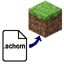

# Schematic Placer
An addon for [WorldEdit](https://enginehub.org/worldedit) that streamlines placing schematic files in Minecraft.

## Commands
#### `schemplace <filename> [<pos>] [<ignoreAir>]` 
loads and places a schematic. Loading is done asynchronously and placement happens over multiple ticks if necessary (see [batchSize](#batchSize)).
#### `schemremove <filename> [<pos>] [<ignoreAir>]` 
Sets blocks to air that are contained in the schematic. Uses the same loading and placement logic as 'schemplace'.
#### `schemanimate <filename> [<pos>] [<ticksPerFrame>] [<start>] [<end>] [<step>] [<loop>] [<removeWhenDone>] [<clearPrevFrame>] [<ignoreAir>]`
Sequentially places schematics using the same logic as 'schemplace'.
#### `schemstopanimate <filename> [<pos>] [<ticksPerFrame>] [<start>] [<end>] [<step>] [<loop>] [<removeWhenDone>] [<clearPrevFrame>] [<ignoreAir>]`
Stops any currently running animation that matches the given parameters.
#### `schemwait <ticksToWait> [<waitId>]`
Waits for the specified number of ticks
#### `schemstopwait <ticksToWait> [<waitId>]`
Stops any currently running wait task that matches the given parameters. Note: use the waitId to avoid overlap.
#### `schemstream <port> [<pos>] [<skipLaggingFrames>] [<removeWhenDone>] [<clearPrevFrame>], [<ignoreAir>]`
Opens a port and begins streaming schematics via TCP. A new client connection must be made for each sent schematic.
#### `schemstopstream <port> [<pos>] [<skipLaggingFrames>] [<removeWhenDone>] [<clearPrevFrame>], [<ignoreAir>]`
Stops any existing stream that matches the given parameters.
#### `schemsequence <line>`
Runs a sequence of comma-separated commands. Supported commands are 'schemplace', 'schemremove', 'schemanimate', 'schemstopanimate', 'schemwait', 'schemstopwait'.
#### `schemstopsequence <line>`
Stops any currently running sequence that matches the given parameters.
#### `schemitem <line>` 
Attaches a command (or list of comma-separated commands) to an item by adding the command to the item's Lore. The command(s) are activated using right click. If there is just a single command attached, shift right clicking will invert the command e.g. (place -> remove) or (start -> stop). If there is a sequence, shift right clicking will stop the sequence. Supported commands are the same as those supported by 'schemsequence'.
#### `schemtask list|stop|clear`
Provides access to the schematic task queue. 'list' prints out all queued tasks. 'stop' stops all queued tasks. 'clear' forcibly removes all queued tasks. 
#### `schemreloadcache`
Reloads the schematic cache assuming [cacheSchematics](#cacheSchematics) is enabled.

| Parameter               | Default Value   | Explanation |
|-------------------------|-----------------|-------------|
| `<filename>`            | *required*      | Path or pattern for the schematic file(s). Supports `%d` formatting for frame numbers. |
| `[<pos>]`               | Player position | World coordinates where the schematic is pasted. Accepts absolute or relative (`~ ~ ~`) values. |
| `[<ticksPerFrame>]`     | `0`             | Number of ticks between the start of each frame. If exceeded, the next frame will start as soon as possible. `-1` = wait until the schematic file exists. |
| `[<start>]`             | `0`             | First frame number in the sequence. |
| `[<end>]`               | `-1`            | Last frame number in the sequence (inclusive). `-1` = keep going until the schematic does not exist. |
| `[<step>]`              | `1`             | How much to increment (or decrement if negative) the frame number each step. |
| `[<loop>]`              | `false`         | If `true`, restart at `<start>` when the sequence finishes. |
| `[<removeWhenDone>]`    | `true`          | If `true`, remove the last schematic frame when the animation completes. |
| `[<clearPrevFrame>]`    | `true`          | If `true`, automatically remove blocks from the previous frame before placing the next. |
| `[<ignoreAir>]`         | `true`          | If `true`, skip air blocks when pasting (can increase performance). |
| `<port>`                | *required*      | TCP port to open. If `0`, automatically allocate. |
| `[<skipLaggingFrames>]` | `true`          | If `true`, skip any pending frames up to the latest loaded frame. |

- Note: running a command that is already running will instead pause or un-pause the task.

## Configuration

The config file will be located in the .minecraft folder at `config/schemplacer.json`.
#### `batchSize`
The maximum number of blocks that can be placed per game tick.

#### `cacheSchematics`
Whether to cache all schematics into memory to increase placement speed.

#### `schematicDir`
Path to the location where scematics are loaded from. Accepts local paths to `.minecraft` or absolute paths.

#### `commandOutput`
Whether to output command feedback to the player.
